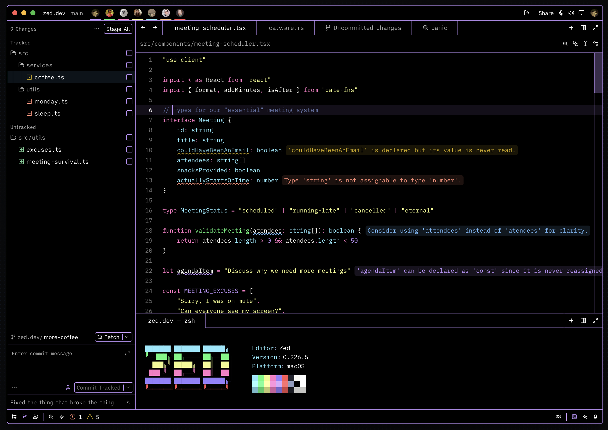
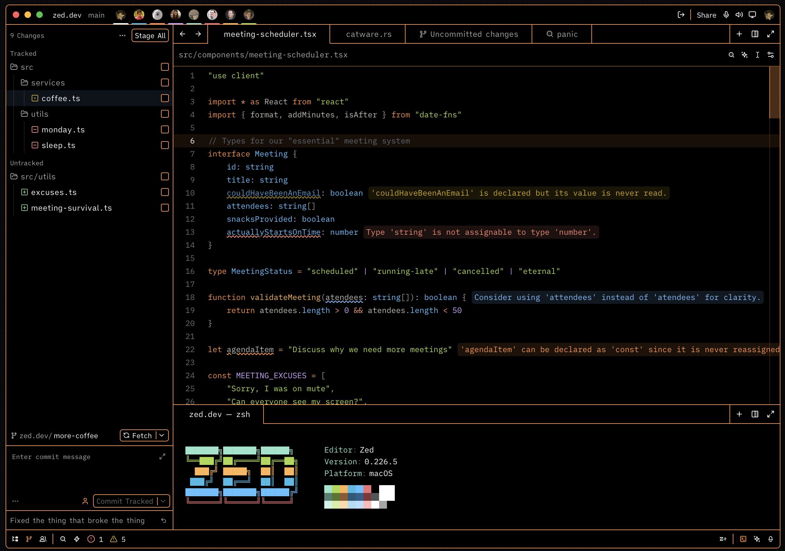
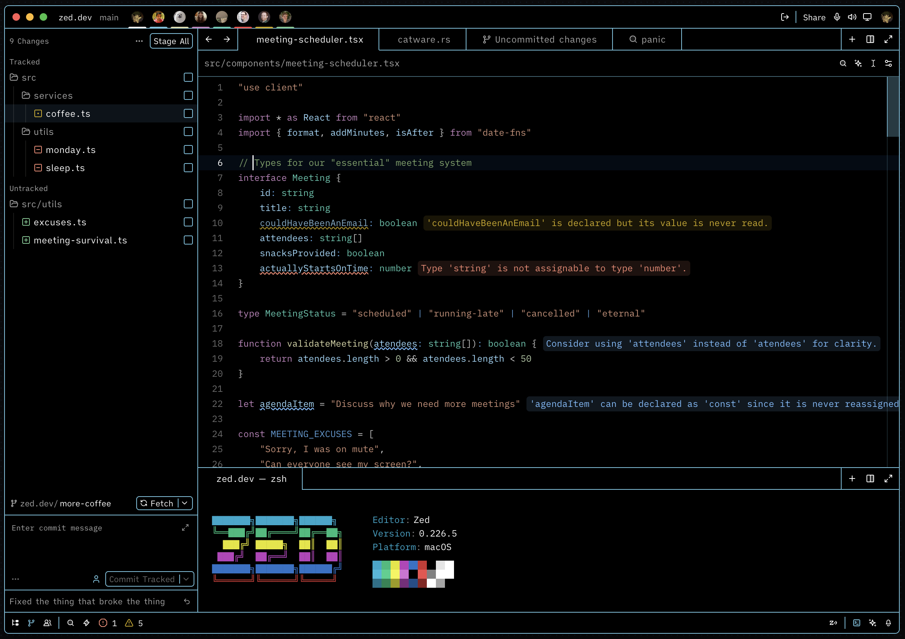
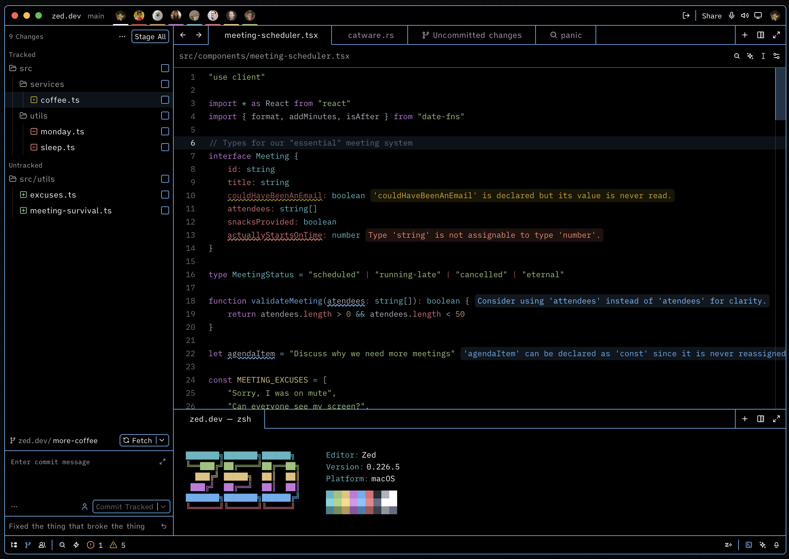
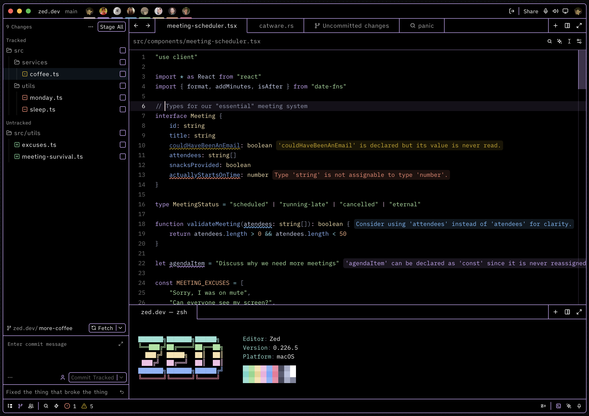
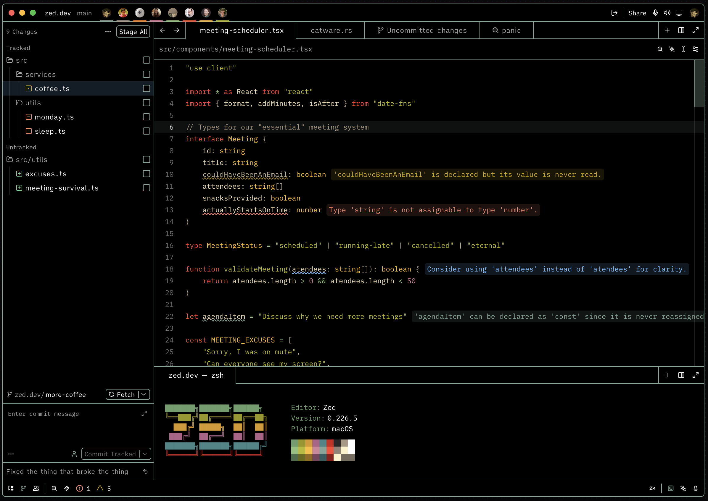
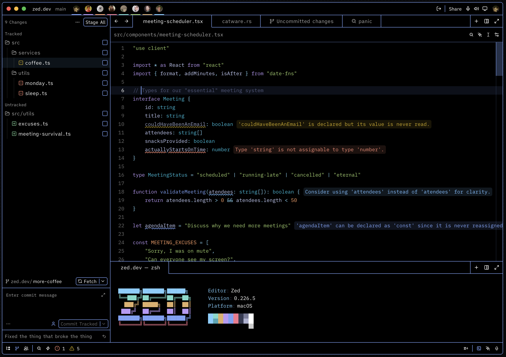
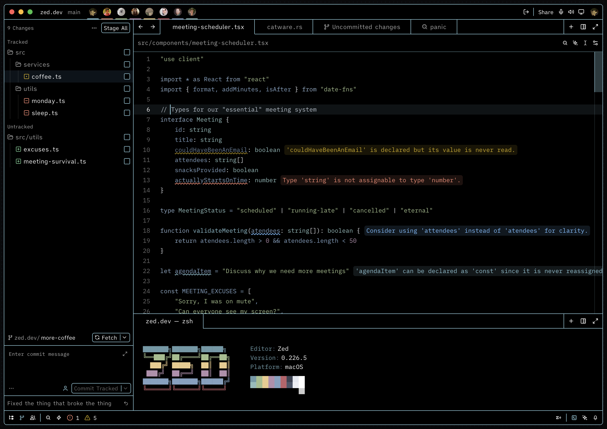
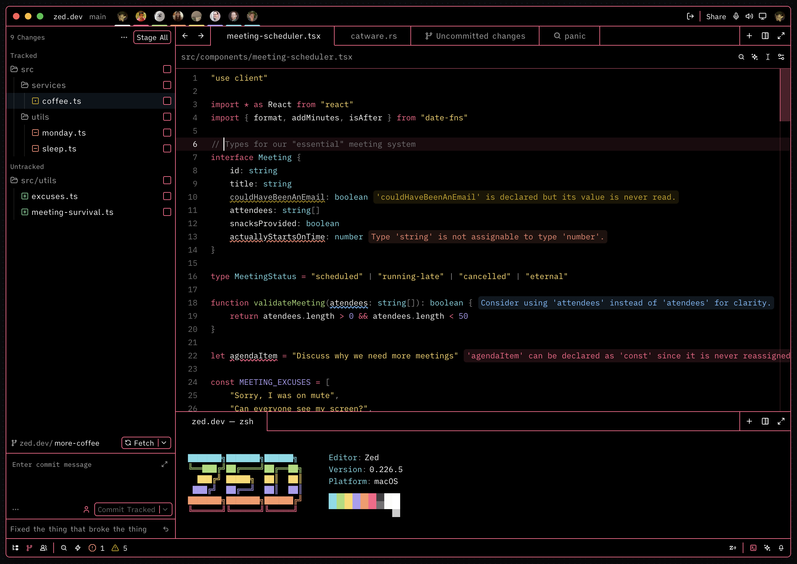
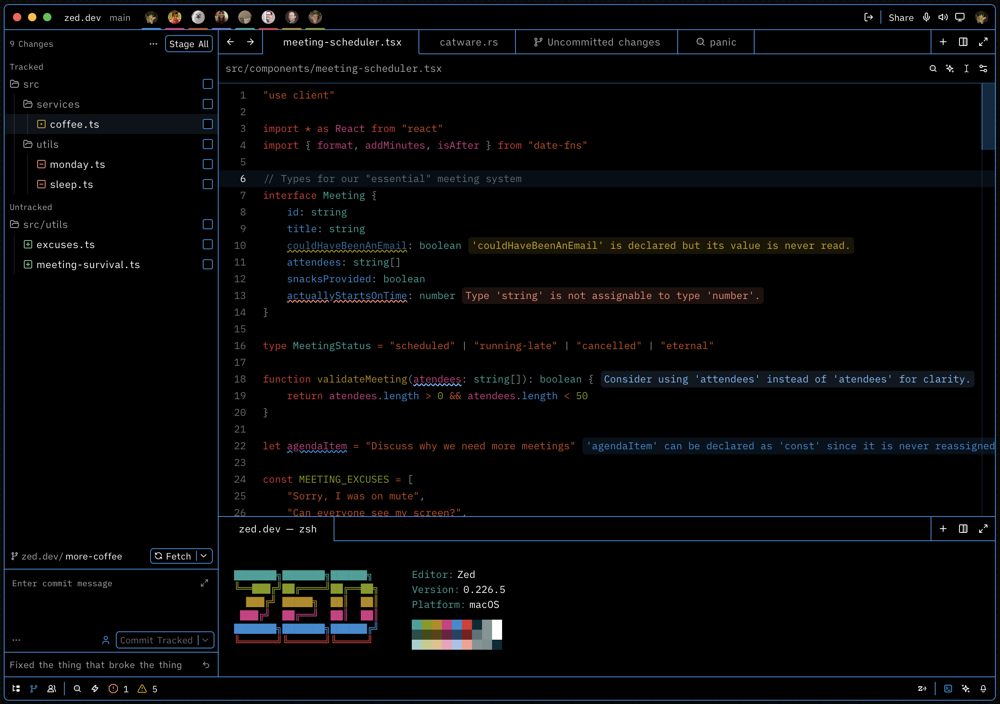

<h3 align="center">
	High Contrast Themes for <a href="https://zed.dev/">Zed</a>
</h3>

	
	
	

	

High-contrast variants of your favorite dark themes for Zed — designed for maximum readability and reduced eye strain.

## Themes

| Theme | Base |
|---|---|
| High Contrast Ayu | [Ayu](https://github.com/ayu-theme/ayu-colors) |
| High Contrast VSCode | VSCode Dark+ |
| High Contrast One Dark | [One Dark](https://github.com/atom/one-dark-ui) |
| High Contrast Catppuccin Mocha | [Catppuccin Mocha](https://github.com/catppuccin/catppuccin) |
| High Contrast Gruvbox | [Gruvbox](https://github.com/morhetz/gruvbox) |
| High Contrast Tokyo Night | [Tokyo Night](https://github.com/enkia/tokyo-night-vscode-theme) |
| High Contrast Dracula | [Dracula](https://draculatheme.com/) |
| High Contrast Nord | [Nord](https://www.nordtheme.com/) |
| High Contrast Monokai | [Monokai](https://monokai.pro/) |
| High Contrast Solarized Dark | [Solarized](https://ethanschoonover.com/solarized/) |

## Previews

High Contrast Ayu

High Contrast VSCode

High Contrast One Dark

High Contrast Catppuccin Mocha

High Contrast Gruvbox

High Contrast Tokyo Night

High Contrast Dracula

High Contrast Nord

High Contrast Monokai

High Contrast Solarized Dark

## Usage

1. Open Zed.
2. Open the command palette (<kbd>Cmd</kbd>+<kbd>Shift</kbd>+<kbd>P</kbd>) and enter _zed: extensions_.
3. Search for _High Contrast Zed_ and install the extension.
4. Enter _theme selector: toggle_ in the command palette and select your preferred High Contrast theme from the dropdown.

### Manual Installation

1. Clone this repository or download the `themes/high-contrast-zed.json` file.
2. Place `high-contrast-zed.json` in the `themes/` subfolder inside your [Zed configuration directory](https://zed.dev/docs/configuring-zed#settings-files) (typically `~/.config/zed/themes/`).
3. Restart Zed.
4. Enter _theme selector: toggle_ in the command palette and select your theme.

## Development

1. Clone this repository.
2. Open Zed's command palette and enter _zed: install dev extension_, then select the cloned repository folder.
3. Reload the extension with _zed: reload extensions_ (use _workspace: reload_ if changes aren't reflected immediately).

See the [Zed extension documentation](https://zed.dev/docs/extensions/developing-extensions) for more information.

## License

MIT License — see [LICENSE](LICENSE) for details.
